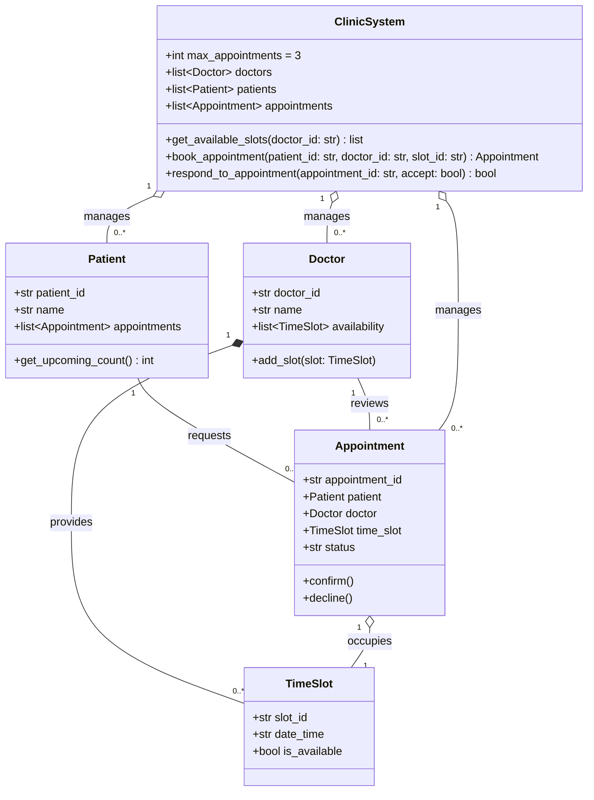

# Class Diagram (P5)

```mermaid
classDiagram
class Patient {
+str patient_id
+str name
+list~Appointment~ appointments
+get_upcoming_count() int
}

class Doctor {
+str doctor_id
+str name
+list~TimeSlot~ availability
+add_slot(slot: TimeSlot)
}

class TimeSlot {
+str slot_id
+str date_time
+bool is_available
}

class Appointment {
+str appointment_id
+Patient patient
+Doctor doctor
+TimeSlot time_slot
+str status
+confirm()
+decline()
}

class ClinicSystem {
+int max_appointments = 3
+list~Doctor~ doctors
+list~Patient~ patients
+list~Appointment~ appointments
+get_available_slots(doctor_id: str) list
+book_appointment(patient_id: str, doctor_id: str, slot_id: str) Appointment
+respond_to_appointment(appointment_id: str, accept: bool) bool
}

Patient "1" -- "0..*" Appointment : requests
Doctor "1" -- "0..*" Appointment : reviews
Doctor "1" *-- "0..*" TimeSlot : provides
Appointment "1" o-- "1" TimeSlot : occupies
ClinicSystem "1" o-- "0..*" Patient : manages
ClinicSystem "1" o-- "0..*" Doctor : manages
ClinicSystem "1" o-- "0..*" Appointment : manages
```
