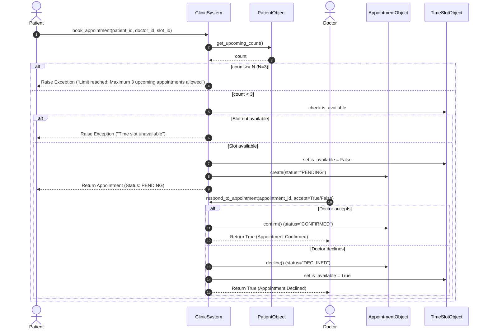

# Sequence Diagram (P6)

```mermaid
sequenceDiagram
    autonumber
    actor Patient
    participant System as ClinicSystem
    participant P as PatientObject
    actor Doctor
    participant Appt as AppointmentObject
    participant Slot as TimeSlotObject

    Patient->>System: book_appointment(patient_id, doctor_id, slot_id)
    System->>P: get_upcoming_count()
    P-->>System: count

    alt count >= N (N=3)
        System-->>Patient: Raise Exception ("Limit reached: Maximum 3 upcoming appointments allowed")
    else count < 3
        System->>Slot: check is_available
        alt Slot not available
            System-->>Patient: Raise Exception ("Time slot unavailable")
        else Slot available
            System->>Slot: set is_available = False
            System->>Appt: create(status="PENDING")
            System-->>Patient: Return Appointment (Status: PENDING)
            
            Doctor->>System: respond_to_appointment(appointment_id, accept=True/False)
            alt Doctor accepts
                System->>Appt: confirm() (status="CONFIRMED")
                System-->>Doctor: Return True (Appointment Confirmed)
            else Doctor declines
                System->>Appt: decline() (status="DECLINED")
                System->>Slot: set is_available = True
                System-->>Doctor: Return True (Appointment Declined)
            end
        end
    end
```
